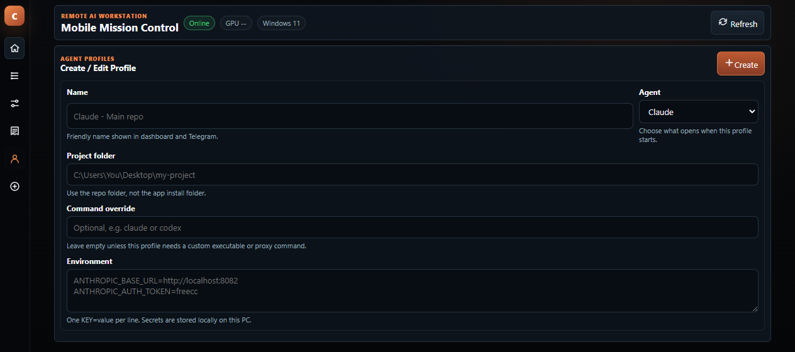
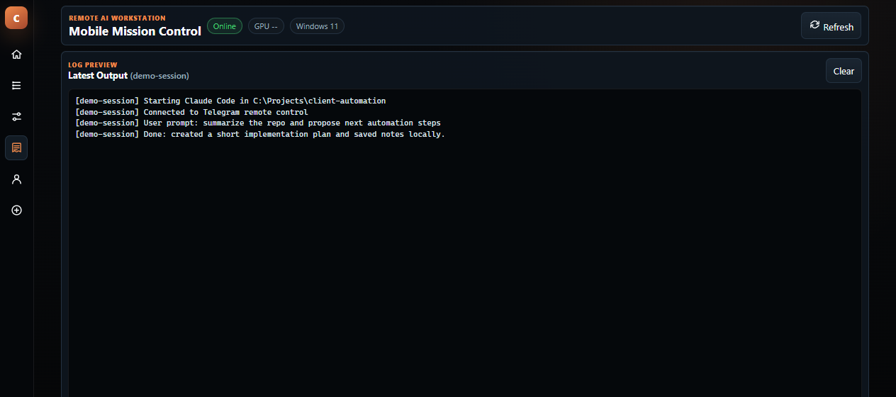
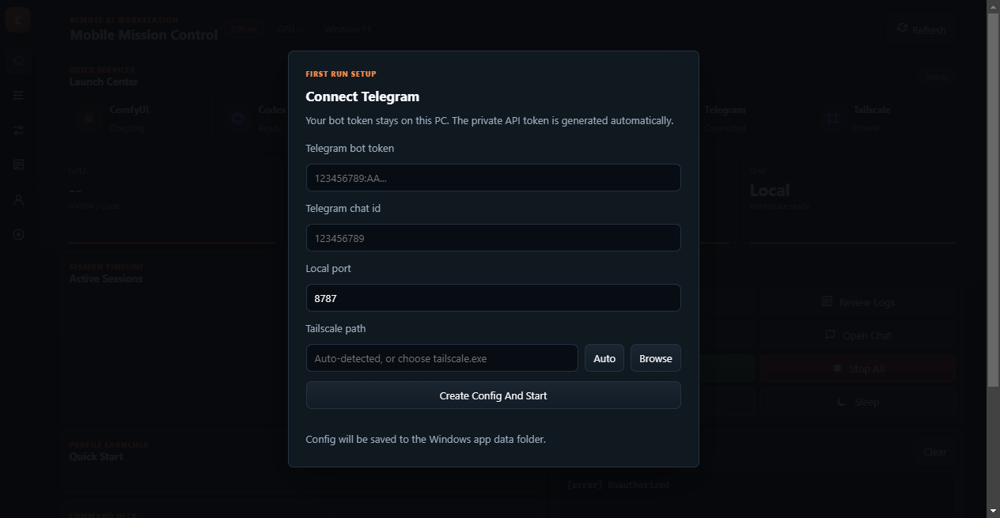

# KAEL OS

KAEL OS is a Windows 11 remote AI workstation for controlling local coding agents from a desktop app or an Android phone over Tailscale.

The project is built for a personal PC that stays powered on, runs local tools such as Codex CLI and Claude Code, and exposes a private mobile-first control surface without opening public ports.


## What It Solves

AI coding agents usually live inside one terminal on one machine. KAEL OS turns that machine into a small remote operations console:

- Start Codex, Claude Code, PowerShell, or custom local commands.
- Keep PTY-backed terminal sessions alive while you reconnect from another device.
- Send prompts from a phone through a private Tailscale URL.
- Watch live terminal output in a mobile-friendly interface.
- Generate a QR code for quick phone access.
- Package the same dashboard as a Windows Electron app.

## Current Features

- Windows desktop app with Electron.
- Mobile-first PWA dashboard.
- Embedded terminal view for active agent sessions.
- REST API protected by an `API_TOKEN`.
- WebSocket updates for status and session output.
- Session manager with start, stop, logs, history, and health state.
- Agent profiles with working directory, command override, and environment variables.
- Codex CLI, Claude Code, PowerShell, and custom command launchers.
- Tailscale IP detection and private access URL generation.
- QR code for Android access through Tailscale.
- CPU, RAM, GPU, disk, and service status cards.
- Optional Telegram bot notifications and fallback controls.
- Windows setup, startup, build, and smoke-test scripts.

## Screenshots

| Dashboard | Workflow | Result View | Setup |
| --- | --- | --- | --- |
|  |  |  |  |

## Tech Stack

- **Runtime:** Node.js 20+, TypeScript
- **Backend:** Express, WebSocket `ws`, Zod, Pino
- **Sessions:** `node-pty`, PowerShell, Codex CLI, Claude Code
- **Desktop:** Electron, electron-builder
- **Frontend:** Static HTML/CSS/JavaScript PWA, xterm.js
- **Integrations:** Tailscale CLI detection, Telegram via Telegraf, NVIDIA `nvidia-smi`
- **Platform:** Windows 11

## Architecture

```text
Android PWA / Electron Desktop
        |
        | REST + WebSocket
        v
Node.js backend on Windows
        |
        | PTY sessions
        v
Codex CLI / Claude Code / PowerShell / custom tools
```

The backend owns authentication, profile storage, session lifecycle, logs, WebSocket broadcasts, system metrics, Tailscale detection, and optional Telegram integration. Electron wraps the dashboard in a Windows app and provides the first-run setup experience.

More detail: [docs/ARCHITECTURE.md](docs/ARCHITECTURE.md)

## Requirements

- Windows 11
- Node.js 20 LTS or newer
- PowerShell
- Tailscale on the PC and phone for private remote access
- Optional: Codex CLI, Claude Code, Ollama, ComfyUI, NVIDIA drivers/tools

## Quick Start

```powershell
npm install
copy .env.example .env
npm run build
npm run smoke
npm run dev
```

Open the local dashboard:

```text
http://127.0.0.1:8787
```

For desktop development:

```powershell
npm run desktop:dev
```

For the Windows installer:

```powershell
npm run desktop:dist
```

For a fuller Windows setup guide, see [docs/SETUP.md](docs/SETUP.md).

## Main Commands

```powershell
npm run dev           # Run the TypeScript backend in development
npm run typecheck     # Run strict TypeScript checks
npm run build         # Compile backend and desktop entrypoints
npm run start         # Run the compiled backend
npm run smoke         # Start a temporary server and verify core API/session flow
npm run desktop:dev   # Build and open the Electron app
npm run desktop:dist  # Build the Windows installer
```

## Configuration

Copy `.env.example` to `.env` and set local values:

```env
PORT=8787
API_TOKEN=replace-with-a-long-random-token
CODEX_COMMAND=codex
CLAUDE_COMMAND=claude
POWERSHELL_COMMAND=powershell.exe
```

Telegram is optional:

```env
TELEGRAM_BOT_TOKEN=
TELEGRAM_ALLOWED_CHAT_IDS=
TELEGRAM_STREAM_CHAT_ID=
```

Never commit `.env`. The Electron app stores first-run config under the user's app data directory instead of the installed program folder.

## Phone Access

1. Install and log in to Tailscale on the Windows PC.
2. Install and log in to Tailscale on the Android phone.
3. Start KAEL OS on the PC.
4. Open the `Access` tab or the `Phone QR` button in the terminal view.
5. Scan the QR code with the phone.

The QR URL includes the local API token in the URL hash so the phone can authenticate without exposing the token to the server logs.

## Security Notes

- Use Tailscale or another private network. Do not expose KAEL OS directly to the public internet.
- Keep `API_TOKEN` and Telegram bot tokens private.
- Restrict Telegram access with `TELEGRAM_ALLOWED_CHAT_IDS` if Telegram is enabled.
- Treat remote prompts as remote command capability because agents can run tools.
- Use dedicated project folders for agent work.

## Portfolio Highlights

KAEL OS demonstrates:

- AI automation and agent orchestration.
- Windows-first internal tooling.
- Desktop + web hybrid app design.
- Remote terminal/session management with PTY.
- Mobile PWA UX for local developer tools.
- Private-network access patterns with Tailscale.
- Practical "vibe coding" workflows with real local process control.

## Future Work

These are intentionally not claimed as complete in the current version:

- Full ComfyUI prompt queue, progress tracking, and image browser.
- Full Ollama model browser and prompt runner.
- Discord webhook notifications.
- File manager for upload/download from the dashboard.
- Remote screenshot delivery.
- Voice notifications.
- Plugin loader with a real extension API.
- Auto-update flow for the Electron app.
- More polished installer branding and custom app icon.
- Stronger multi-user permission model.

## Repository Hygiene

The repo should include source code, docs, and safe screenshots only. It should not include:

- `.env` files
- tokens or API keys
- `node_modules/`
- `dist/`
- `release/`
- runtime `logs/`
- runtime `sessions/`
- private planning notes

## License

No license has been selected yet.
