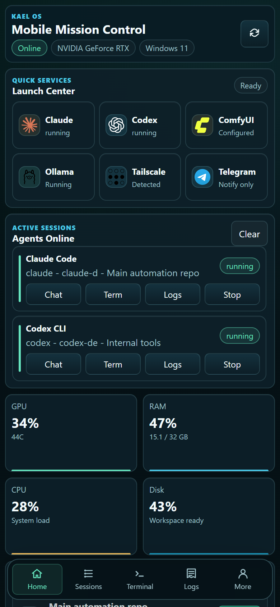
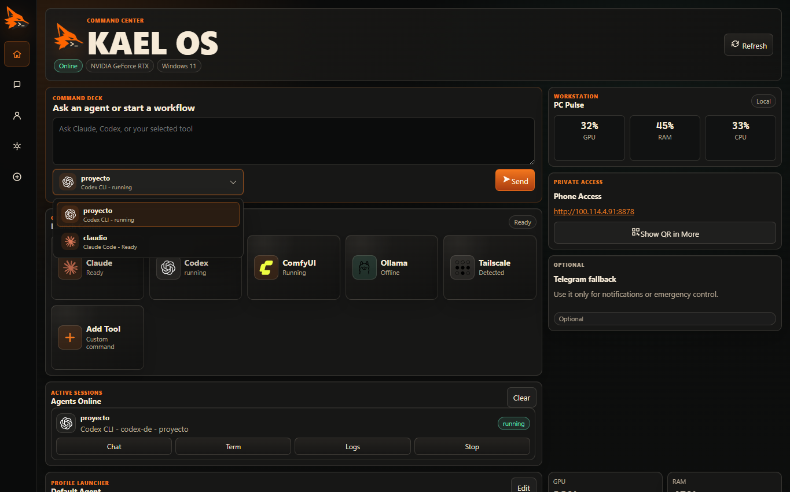
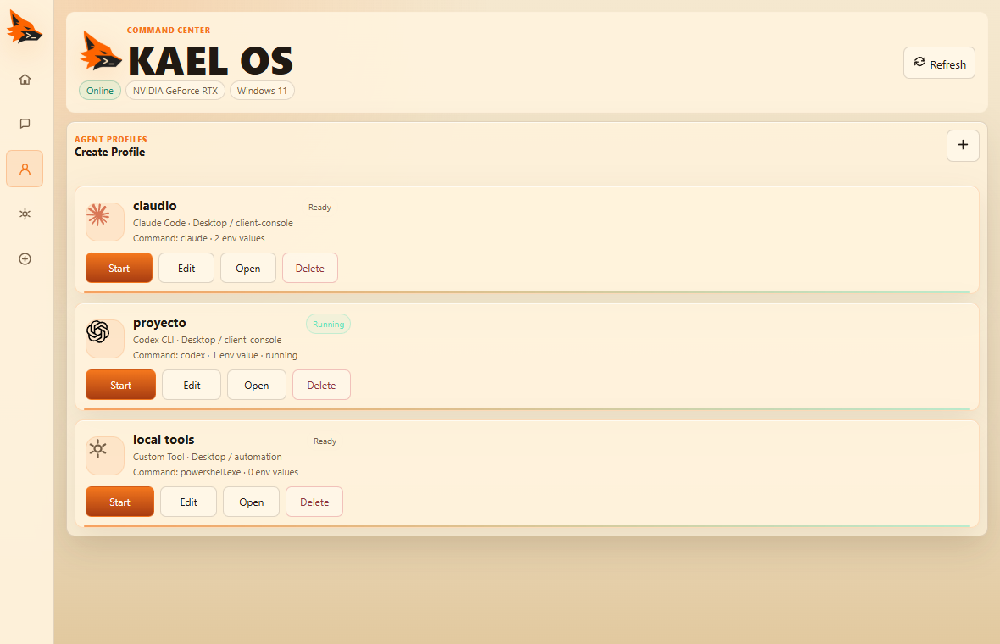
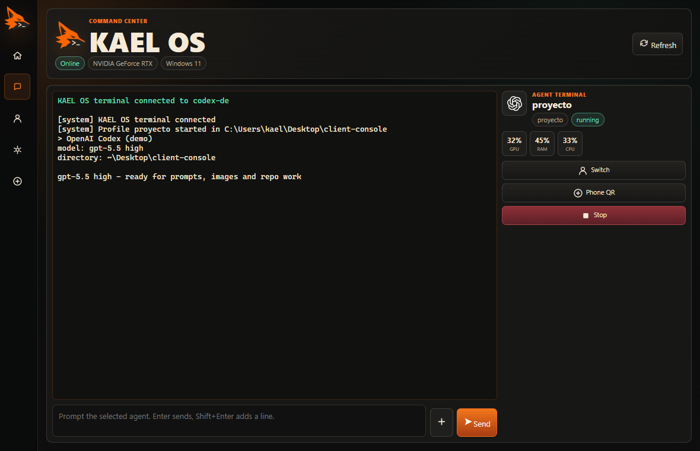
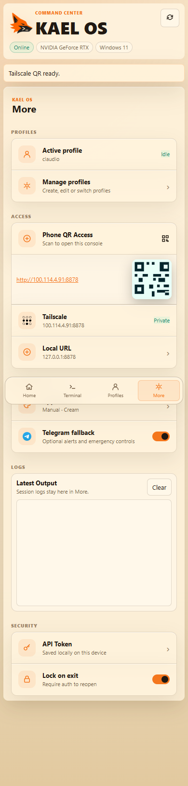

# KAEL OS

KAEL OS is a private Windows command center for running local AI agents from a desktop app, a browser, or a phone on Tailscale.

It is built for the kind of workstation that stays on: Codex CLI, Claude Code, local services, logs, profiles, QR access, and live terminal sessions all in one compact control surface.



## Highlights

- Launch Codex CLI, Claude Code, PowerShell, or custom tools from saved profiles.
- Use one Command Deck selector with agent logos, profile names, live session state, and prompt routing.
- Keep PTY-backed terminal sessions alive while switching between desktop and phone.
- Send prompts from the dashboard or the terminal composer without focusing the raw terminal.
- Attach image and text files from the chat composer.
- Manage profiles with project folders, command overrides, and local environment variables.
- Open private access from Tailscale or local URLs, with QR access tucked into More.
- Track PC health with compact CPU, RAM, GPU, and service status panels.
- Run as a Windows Electron app or as a local web dashboard.

## Screenshots

| Dashboard | Command Deck |
| --- | --- |
|  |  |

| Profiles | Agent Terminal |
| --- | --- |
|  |  |

| Mobile More |
| --- |
|  |

## What Changed Recently

The latest UI pass focuses on clarity:

- The Command Deck no longer duplicates agent chips above the prompt.
- The native session select was replaced with a custom dropdown that can show Claude and OpenAI logos.
- OpenAI/Codex renders black in light mode and white in dark mode.
- Profile cards use centered SVG logos and light-mode-safe action buttons.
- The profile editor opens inline below the selected profile.
- The Save button is compact, and create-profile is a simple plus action.
- Logs live in More, while the main dashboard stays focused on active work.

## Architecture

```text
Electron Desktop / Browser / Phone PWA
        |
        | REST API + WebSocket
        v
Node.js backend on Windows
        |
        | PTY sessions
        v
Codex CLI / Claude Code / PowerShell / local tools
```

The backend owns authentication, profile storage, session lifecycle, logs, WebSocket broadcasts, system metrics, Tailscale detection, and optional Telegram fallback controls. The frontend is a static PWA wrapped by Electron for Windows desktop use.

More detail: [docs/ARCHITECTURE.md](docs/ARCHITECTURE.md)

## Tech Stack

- **Runtime:** Node.js 20+, TypeScript
- **Backend:** Express, WebSocket `ws`, Zod, Pino
- **Sessions:** `node-pty`, Codex CLI, Claude Code, PowerShell
- **Desktop:** Electron, electron-builder
- **Frontend:** HTML, CSS, JavaScript, xterm.js
- **Integrations:** Tailscale CLI detection, Telegram via Telegraf, NVIDIA metrics
- **Automation:** Playwright for polished screenshot generation

## Requirements

- Windows 11
- Node.js 20 LTS or newer
- PowerShell
- Tailscale on the PC and phone for private remote access
- Optional: Codex CLI, Claude Code, Ollama, ComfyUI, NVIDIA drivers/tools

## Quick Start

```powershell
npm install
copy .env.example .env
npm run build
npm run smoke
npm run dev
```

Open:

```text
http://127.0.0.1:8787
```

Desktop development:

```powershell
npm run desktop:dev
```

Build the Windows app:

```powershell
npm run desktop:dist
```

For a fuller Windows setup guide, see [docs/SETUP.md](docs/SETUP.md).

## Main Commands

```powershell
npm run dev           # Run the TypeScript backend in development
npm run typecheck     # Run TypeScript checks
npm run build         # Compile backend and desktop entrypoints
npm run start         # Run the compiled backend
npm run smoke         # Verify the core API/session flow
npm run screenshots   # Regenerate README screenshots
npm run desktop:dev   # Build and open the Electron app
npm run desktop:dist  # Build the Windows installer
```

## Configuration

Copy `.env.example` to `.env` and set local values:

```env
PORT=8787
API_TOKEN=replace-with-a-long-random-token
CODEX_COMMAND=codex
CLAUDE_COMMAND=claude
POWERSHELL_COMMAND=powershell.exe
```

Telegram is optional:

```env
TELEGRAM_BOT_TOKEN=
TELEGRAM_ALLOWED_CHAT_IDS=
TELEGRAM_STREAM_CHAT_ID=
```

Never commit `.env`. The Electron app stores first-run config under the user's app data directory instead of the installed program folder.

## Phone Access

1. Install and log in to Tailscale on the Windows PC.
2. Install and log in to Tailscale on the phone.
3. Start KAEL OS on the PC.
4. Open More and expand Phone QR Access.
5. Scan the QR code.

The QR URL includes the local API token in the URL hash so the phone can authenticate without exposing the token to server logs.

## Secure By Design

KAEL OS is designed for private workstation control, not public exposure. The dashboard is protected by an API token, phone access is intended to run through Tailscale, and QR authentication keeps the token in the URL hash so it does not land in server logs.

Sensitive configuration stays local: `.env` is ignored, Electron stores first-run config in the user's app data directory, and profile environment values are kept on the PC. Telegram support is optional and can be restricted to explicit allowed chat IDs.

Because agent prompts can trigger local tools, KAEL OS treats remote access as real workstation access. It works best behind a private network, with dedicated project folders and credentials kept out of the repository.

## Built To Show

KAEL OS demonstrates:

- AI agent orchestration for local developer workflows.
- Windows-first internal tooling.
- Desktop, web, and phone UX in one product.
- PTY session management and live terminal streaming.
- Private-network access with Tailscale.
- Practical profile-driven workflows for Codex CLI and Claude Code.

## Future Work

- Full ComfyUI prompt queue, progress tracking, and image browser.
- Full Ollama model browser and prompt runner.
- Discord webhook notifications.
- File manager for upload/download from the dashboard.
- Remote screenshot delivery.
- Voice notifications.
- Plugin loader with a real extension API.
- Auto-update flow for the Electron app.
- Stronger multi-user permission model.

## Repository Hygiene

The repo should include source code, docs, and product screenshots only. It should not include:

- `.env` files
- tokens or API keys
- `node_modules/`
- `dist/`
- `release/`
- runtime `logs/`
- runtime `sessions/`
- private planning notes

## License

No license has been selected yet.
